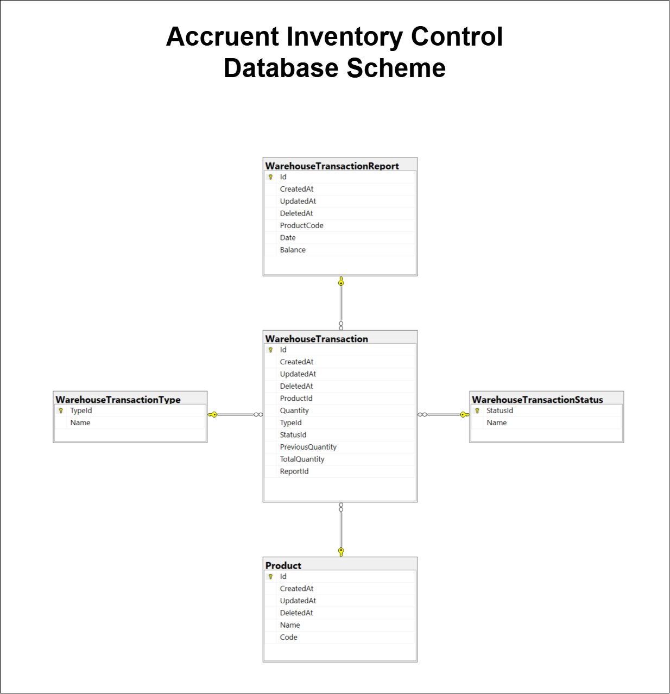

# Database Design with SQL Types

## 1. Product Table
This table represents products in the system.

**Columns:**
- `Id` → `BIGINT PRIMARY KEY`
- `CreatedAt` → `DATETIME NOT NULL`
- `UpdatedAt` → `DATETIME NOT NULL`
- `DeletedAt` → `DATETIME NULL`
- `Name` → `NVARCHAR(255) NOT NULL`
- `Code` → `NVARCHAR(100) NOT NULL`

## 2. WarehouseTransaction Table
This table logs transactions related to product inventory.

**Columns:**
- `Id` → `BIGINT PRIMARY KEY`
- `CreatedAt` → `DATETIME NOT NULL`
- `UpdatedAt` → `DATETIME NOT NULL`
- `DeletedAt` → `DATETIME NULL`
- `ProductId` → `BIGINT NOT NULL`, FOREIGN KEY to `Product.Id`
- `Quantity` → `INT NOT NULL`
- `Type` → `INT NOT NULL`, FOREIGN KEY to `WarehouseTransactionType.Id`
- `Status` → `INT NOT NULL`, FOREIGN KEY to `WarehouseTransactionStatus.Id`
- `PreviousQuantity` → `INT NOT NULL`
- `TotalQuantity` → `INT NOT NULL`

## 3. WarehouseTransactionReport Table
This table aggregates reports of inventory transactions.

**Columns:**
- `Id` → `BIGINT PRIMARY KEY`
- `CreatedAt` → `DATETIME NOT NULL`
- `UpdatedAt` → `DATETIME NOT NULL`
- `DeletedAt` → `DATETIME NULL`
- `ProductId` → `BIGINT NOT NULL`, FOREIGN KEY to `Product.Id`
- `Date` → `DATETIME NOT NULL`: Date of the report.
- `Balance` → `INT NOT NULL`: Calculated balance of product inventory.

## 4. WarehouseTransactionStatus Table
This table aggregates lookups of transaction status.

**Columns:**
- `StatusId` → `INT PRIMARY KEY`
- `Name` → `NVARCHAR(50) NOT NULL`

## 5. WarehouseTransactionType Table
This table aggregates lookups of transaction type.

**Columns:**
- `TypeId` → `INT PRIMARY KEY`
- `Name` → `NVARCHAR(50) NOT NULL`

## Additional Notes
**Indexes:**
- Create indexes on frequently queried fields like `Product.Code` and `WarehouseTransaction.ProductId` for faster lookups.
